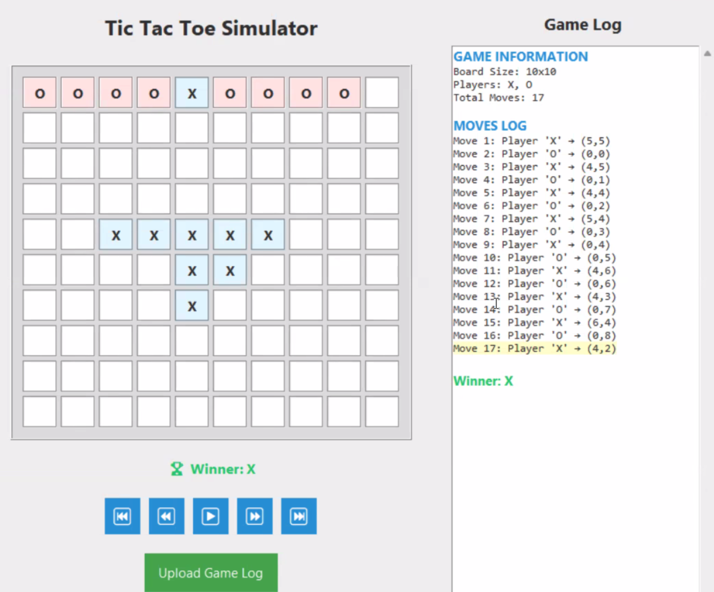
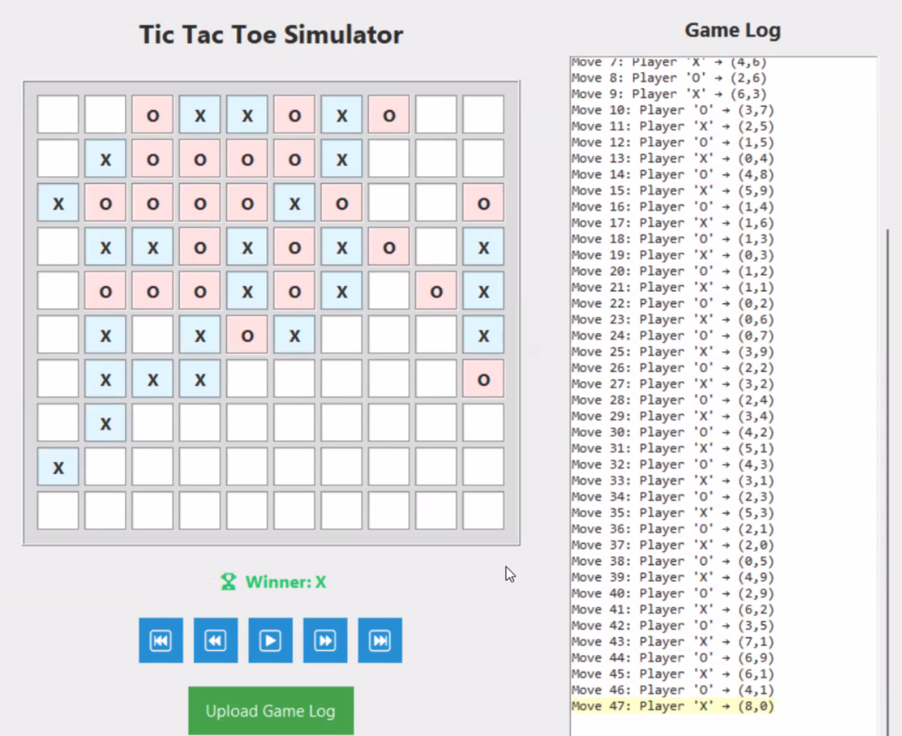

## Introduction

I was just doomscrolling on instragram reels when I saw a post from the C.R.E.A.T.E. club of UTSC about their upcoming Code Clash competition.
They said that there will be two games that we will have to make bots for.

So I signed up, thinking that it would be a fun way to spend my weekend.

## My background on chess engines and bot programming

I'm quite familiar with chess engines and bot programming, because I was interested in them when I was in high school.
I used to play chess a lot, and in the first few years of me learning about C++,
I would read some portions of the [Gull 3](https://sourceforge.net/projects/gullchess/) source code,
which was a very popular open-source chess engine at the time.
Of course, I didn't understand most of it at that time,
but I was just fascinated by the idea of making a bot that can play a game.

A few years ago, I also wrote my own tic-tac-toe bot in Rust, which was a fun project.
::github{repo="kako57/blank"}
「」 never loses, but I don't think it plays optimally. Maybe, I messed up the evaluation function...

Throughout the years of my high school, I kept up with the development of chess engines,
and how they work under the hood. My fascination with chess engines never really went away,
especially when I saw the rise of neural network-based engines like
[AlphaZero](https://en.wikipedia.org/wiki/AlphaZero) and [Leela Chess Zero](https://en.wikipedia.org/wiki/Leela_Chess_Zero).
And of course, the NNUE (Efficiently Updatable Neural Network) architecture from Shogi engines that was introduced in Stockfish 12.

I also used to play a lot of [CodinGame](https://codingame.com) challenges,
which are basically programming challenges where you write a bot to play a game against other bots.
I forgot the account I used back then, but I remember that I had a lot of fun playing those challenges.
In CodinGame, I participated in a lot of Clash of Code competitions,
which are basically live competitions where you have to quickly solve programming challenges.
Players show their solutions to the public after the competition ends, so I learned a lot from them.

## Preparation

When I signed up for Code Clash, there was only about a week left - probably even less - until the competition.
At this time, I still don't know what the games were going to be, so I started preparing for the worst.

I created a new account on CodinGame and started practicing.
I chose to go to the "Bot Programming" section, which has a lot of challenges that involve writing bots to play games.
After a disappointing run on the Fall Challenge 2020, I decided to switch things up and try out their "Ultimate Tic-Tac-Toe" challenge.

[Ultimate Tic-Tac-Toe](https://www.codingame.com/multiplayer/bot-programming/tic-tac-toe) is a bit different from the regular tic-tac-toe, as it has a 3x3 grid of tic-tac-toe boards,
and the goal is to win by winning three boards in a row, column, or diagonal.

I did some very basic minimax to get out of the Wood League, which only makes you play the standard 3x3 tic-tac-toe.
My minimax wasn't even optimal, but it was enough to beat the boss.

After that, I now had to play the Ultimate Tic-Tac-Toe in the Bronze Leage, which was a bit more challenging.
I first started with a very simple strategy, where I just perform a ton of rollouts for every available move,
and choose the move that has the highest win rate. That led me to Silver League, and from there, it's all about
who can optimize their Monte Carlo Tree Search (MCTS) the best.

I didn't have time to continue climbing the ranks, as the competition was just around the corner.

## Competition starts!

The competition started on 11 July 2025, and I was actually quite exhausted from all the grind I did for the week
coming up to the competition. But they finally revealed the games that we had to make bots for:

- Tic-Tac-Toe, but it's on a 10x10 board, and you can win by getting 5 in a row, instead of 3.
- Chess, but the board is 5x5,
  and there is a setup phase where you can place your pieces on the board,
  and you can activate abilities.

There are actually more details about the custom chess game, but I won't go into that, because I decided to focus on the tic-tac-toe game.
In fact, I didn't even try to make a chess bot, because I was too tired trying to make a tic-tac-toe bot that can win against other bots.

Why did I want to focus on the tic-tac-toe game? Because I want to win.
Why did I want to win? Because one of the organizers said that Code Clash is a "hackathon".


There's also some game theory behind why I chose tic-tac-toe over chess:

> - Considering the time constraints, I don't think people will be able to make a good chess bot, unless they are good at theorycrafting.
    Making a chess engine compliant with all the rules of the game is a lot of work, and I don't think people will have time to do that.
> - Tic-Tac-Toe is a simpler game, and I can use my previous experience with it to make a bot that can win against other bots.
> - I have a 100% win rate in hackathons, if we're talking about winning a prize. Well, some people would say that I cheesed those prices (e.g., overengineering infrastructure by using Microsoft Azure)...
> - More people to face means that winning is more rewarding, proving that my 100% win rate in hackathons is not a fluke.

## Research and Theorycrafting

When I heard of the win condition for the tic-tac-toe game, I didn't think of an algorithm to solve it right away.

I first thought of an anime I watched back in high school, called [Hikaru no Go](https://en.wikipedia.org/wiki/Hikaru_no_Go).
I remember an episode where one of the characters - I think it was Akari,
the childhood friend of Hikaru - said that she didn't know Go, but she knew another game.
It was played on a go board, but the goal was similar to tic-tac-toe, where you need to have five contiguous stones of your color in a row, column, or diagonal to win.

I then searched for the game, and found out that it was called [Gomoku](https://en.wikipedia.org/wiki/Gomoku).
I then read the Wikipedia article about it, and found out that for the freestyle version (Gomoku),
there is a heavy advantage for the first player. Some are saying that for freestyle Gomoku, the first player can always win with perfect play.

I then read an [article](https://www.researchgate.net/publication/2252447_Go-Moku_and_Threat-Space_Search) about search techniques for Gomoku,
and found out about threat-space search and proof-number search, and most importantly, the concept of **threats**.
While I didn't use those search techniques in my bot, I noted the idea of counting threats to formulate my evaluation function.

I then found an online [Gomoku Calculator](https://www.gomocalc.com/), that can calculate the best move for a given Gomoku position.
The calculator can be configured to use a different board size, so I set it to 10x10,
and the rule of the game (Gomoku, Renju, Standard, etc.) to "Gomoku".

I then starting playing around with the calculator, playing against it, or making it play against itself.
I quickly observed two very simple things on how the engine picks its moves:

1. For the first move, it always picks the **center of the board**.
2. For most moves, it places a stone in a position that is **adjacent to an existing stone**.

These findings were very interesting, and I noted them down as heuristics to use for my bot.

I then looked into the engine behind the calculator. It was rapfi, which is one of the strongest Gomoku engines available.

::github{repo="dhbloo/rapfi"}

> [!NOTE]
> Rapfi can be compiled to a WebAssembly module, which can be run in the browser.
> This is exactly how the Gomoku Calculator works.
> 
> Stockfish can also be built this way, and is used in the [Lichess](https://lichess.org/analysis) analysis board.

I looked into the source code of Rapfi a bit, and took note of how it evaluates positions,
how it picks moves, and how it saves game states.
Unfortunately, because the mainline Rapfi codebase uses NNUE evaluation (which I refuse to do because training is too much time),
the only thing I can really take note of is the search algorithm, and the use of the hashtable.
Rapfi also used to have a classic heuristic evaluation function.
Regardless of the evaluation method, Rapfi's search algorithm is minimax with alpha-beta pruning.
There was MCTS in there, so I also took note of that as a strategy for an alternative bot.

## Algorithms

To make a really good bot, we need to be able to do the following:

1. Model what optimal play looks like, so that we can find the best move for the current player.
2. Be able to search the game tree efficiently, so that we can find the best move in a reasonable amount of time.
3. Have some good heuristics to evaluate the game state.

For the algorithms, we satisfy goals 1 and 2.
Goal 1 is satisfied by using the minimax algorithm, which attempts to play optimally for both players.
Goal 2 is satisfied by using alpha-beta pruning, which razors out suboptimal play from the search.
A further optimization that I used is transposition tables, which allow us to avoid re-evaluating an already evaluated game state.

### Minimax

**Minimax** is a classic algorithm for two-player games, where the goal is to minimize the maximum loss.
Simply put, we want to find the best move for the current player, assuming that the oppponent will also play optimally for their next moves.

The algorithm works by recursively exploring the game tree, where each node represents a game state.
The algorithm starts at the root node, which is the current game state, and explores all possible moves.
Depending on the depth of the tree (which also describes who is the current player),
the algorithm will either maximize or minimize the score of the game state, and return the optimal move it finds.

To explain the concepts, we will use 3x3 tic-tac-toe games as an example,
where the positions are numbered as follows:

```txt
1 | 2 | 3
---------
4 | 5 | 6
---------
7 | 8 | 9
```

Consider a simple game state where the current player is X, and the board looks like this:

```txt
X |   | O
---------
  |   |  
---------
  |   | 
```

If both players play optimally from this position, it can be shown that there is a forced win for X.

```txt
X |   | O
---------
4 | O |  
---------
X | 8 | X
```

Example: X plays 9, O blocks on 5, X blocks on 7, creating two threats of winning on 4 and 8.

The minimax algorithm would explore the game tree and would find this forced win for X.

If we started the minimax algorithm from an empty board, O would find a way to draw the game.
This is because tic-tac-toe is a solved game, and the optimal play for both players will always lead to a draw.

### Alpha-Beta Pruning

**Alpha-beta pruning** is an optimization technique for the minimax algorithm that reduces the number of nodes that need to be evaluated in the game tree.
The idea to keep in mind is that we can prune branches of the tree that will not affect the final decision.

What gets pruned? To illustrate, consider that the engine that is considering the following state:

```txt
  |   | X
---------
  | O |  
---------
X | O | 
```

If you're X to move, you can see that there is a threat of O winning on 2, so you will need to block that.
Any moves considered after do not block, and are pruned from the search tree,
because they will not lead to a better outcome for X, as O will just win on the next turn.


### Transposition Tables

To understand what a transposition table is, we need to understand what a transposition is.

A transposition is a situation where the same game state can be reached by different sequences of moves.

For example, in tic-tac-toe, the following board state can be reached by four different sequences of moves:

```txt
  |   | 
---------
X | O |  
---------
X | O | 
```

X can start at 7, then 4, or 4, then 7.
O can start at 5, then 8, or 8, then 5.

A transposition table is a data structure that stores the evaluation of game states that have already been evaluated.
This allows the algorithm to avoid re-evaluating the same game state, even when we reach it by a different sequence of moves.

In the example above, if we already evaluated the game state where X is at 7 and O is at 5 (e.g. a win for X),
we can just look it up in the transposition table and use the evaluation we already have,
instead of re-evaluating the game state again.

### Implementation

This is what the implementation of the minimax algorithm with alpha-beta pruning and transposition table looks like:

```c++
// Minimax algorithm with alpha-beta pruning and transposition table utilization
int minimax(GameState& state, int depth, int alpha, int beta, bool maximizingPlayer) {
  // for small game trees, you want to reach the end of the game tree
  // for big game trees, limit your search depth
  if (depth == 0 || state.isGameOver()) {
    int evaluation = state.evaluate();
    transpositionTable[state.hash] = evaluation;
    return evaluation;
  }

  // check the transposition table first
  if (transpositionTable.count(state.hash)) {
    return transpositionTable[state.hash];
  }

  auto moves = state.getLegalMoves();
  if (maximizingPlayer) {
    int maxEval = -1e9;
    for (auto& move : moves) {
      state.applyMove(move); // place the move on the board
      int eval = minimax(state, depth - 1, alpha, beta, false);
      state.undoMove(move); // take it back
      maxEval = max(maxEval, eval);
      alpha = max(alpha, eval);
      // beta-cutoff: when we find a very bad outcome for the maximizing player
      if (beta <= alpha)
        break;
    }

    transpositionTable[state.hash] = maxEval;
    return maxEval;
  } else {
    int minEval = 1e9;
    for (auto& move : moves) {
      state.applyMove(move);
      int eval = minimax(state, depth - 1, alpha, beta, true);
      state.undoMove(move);
      minEval = min(minEval, eval);
      beta = min(beta, eval);
      if (beta <= alpha) {
        break;
      }
    }

    transpositionTable[state.hash] = minEval;
    return minEval;
  }
}
```

I used a hash map to store the transposition table, where the key is the hash of the game state,
The hash is a unique identifier for the game state, which can be generated by a simple hashing function.
If you're wondering what kind of hashing I used, it's called [Zobrist hashing](https://en.wikipedia.org/wiki/Zobrist_hashing),
and it's used in many chess engines and other game engines to efficiently hash game states.

## Heuristics

While I was cramming all my Friday homework for the weekend, I was also teaching another team
about the game theory behind tic-tac-toe, and the general heuristics to look out for when making a bot
for such a game.

For games with very huge search trees, like chess, and tic-tac-toe on a 10x10 board,
it is not economical to run minimax to the end of the game tree and evaluate by counting the number of wins/draws/losses.

Instead, we'll need to have some compromises, and use heuristics to help us
give a good enough evaluation of the game state, and to help us find reasonably good moves.

For my bot, I need heuristics that not only help in evaluating the game state, but also help in finding good moves.

### Threats for evaluation

Threats are a concept that I learned from the Gomoku article I read.
While I have an understanding of what threats are in the context of 3x3 tic-tac-toe,
I didn't really think of what counts as a threat in the context of 10x10 tic-tac-toe.

Consider the following game state for a 3x3 tic-tac-toe game:

```txt
  |   | 
---------
X | O |  
---------
X |   | 
```

A threat in this game state is a position where the current player can win on the next turn.
In this case, X threatens to win on 1.

Obviously, O will block that, and the game will continue... But how do we quantify threats for evaluation?

In the context of 10x10 tic-tac-toe, a threat is a position where the current player can win on the next turn,
but there are also other threats where the current player can win in the next few turns.

The strongest threat in 10x10 tic-tac-toe is an open-ended four-in-a-row.
It is a threat where the current player can win in the next turn,
no matter what the opponent does. It's a forced win.

For example, consider the following game state:

```txt
_ X X X X _
```

No matter where O tries to block, X will win on the next turn, by filling the other end of the row.
From here, you can see that the next strongest threat is four-in-a-row but with one end blocked.
This is then followed by a three-in-a-row with both ends open, then with one end blocked, and so on.
The weakest threat I accounted for is a two-in-a-row with both ends open.

```c++
  auto scoreLine = [](int count, int openEnds) -> int {
    if (count >= 5) return 100000;
    if (count == 4 && openEnds == 2) return 10000;
    if (count == 4 && openEnds == 1) return 1000;
    if (count == 3 && openEnds == 2) return 500;
    if (count == 3 && openEnds == 1) return 100;
    if (count == 2 && openEnds == 2) return 50;
    return 0;
  };
```

It is important to have properly defined values for each threat, such that we can quantitatively say
that one threat is stronger than another.

Also notice that the win condition *is* included in the threats that I evaluate for.
This is because I do not actually define a function or separate evaluation for whether the game has been won or not.
Instead, I simply make sure that it is high enough that the bot will always
choose to reach that "most valuable threat", if possible, instead of any other threats.

This is similar to how classic chess engines would just put a very high material value on the king piece,
so that the engine would do its best to protect it, rather than sacrificing it for other material gains.

### Move selection heuristics

#### Adjacency

When I was playing around with the Gomoku Calculator, I noticed that the engine tends to place stones in positions that are adjacent to existing stones.
This is a very good heuristic, because it allows the bot to build up threats and create more opportunities for winning.
Obviously, this also allows the bot to block the opponent's threats, which is also very important.

#### Center control

This one probably doesn't need much explanation, but it is also a very good heuristic to have.
What I noticed from the Gomoku Calculator is that the first move is always in the center of the board.
This seems to be quite a common strategy for many games, including chess.
But it's even more pronounced in Gomoku, because the center of the board allows the player to create more threats radiating from it.

## Bot implementation

When I was implementing the bot, I didn't really have any problems with writing the ideas to code.
After all, I did some preparation for this, and I had a good understanding of the algorithms and heuristics I wanted to use.

While I was testing an older version of the bot, I realized that it would sometimes beat a copy of itself, after a series of draws.


### Constraints

The big problem was making sure the bot runs within the constraints set by the competition organizers.

> - The program is run in a Docker container, on a x86 machine.
> - The program is limited to 5 seconds of wall clock time.
> - The program is limited to 512 MB of memory.
> - We were told to probably not exceed more than 100MB for the binary size, but that's not really our problem.
>   - Later on, the limit was found to be 50MB, so people were advised to use [UPX](https://upx.github.io/) to compress their binaries.
> - Because the engine is only run when it's their turn, the engine is allowed to create a file, limited to 10 MB size.
  The purpose of the file had to be documented.

Thankfully, I did not run into any memory limit issues.
I also decided that I would not use any file I/O for the bot. While I could have used it to store the transposition table,
I figured that rebuilding it again is just fine, and I don't want to deal with the file I/O overhead.

### Multithreading

At some point, my bot starts to take a long time to run, picking a move by about 3-4 seconds.
I was worried, because what if I was testing on a machine that is definitely more powerful than the machine for the competition?
A 3-4 second runtime might be fine on my machine, but that might mean timeouts on the competition machine, and timeouts mean losses.

I contacted one of the organizeers, and inquired about the CPU they were using for the competition.
It was a quad-core Intel CPU, of the Haswell generation, which is quite old by today's standards.
You think that's old? Well, I was testing my stuff on an Intel i7-6700, which is also a Haswell CPU, but with four hyperthreaded cores.
The bad news is that I have a stronger CPU than the competition machine; the good news is that the difference in performance is not that big,
at least in today's standards.

I still wanted to make sure that my bot runs within the time limit, so I decided to use multithreading to speed up the search.
This meant that I would analyze the candidate moves in parallel, spawning a thread for each candidate move.

### Scheduling caused interesting behaviour on my machine

I also found a very interesting phenomenon when I was testing the multithreaded version of my bot.
Consider this game state:

```json
{
  "board": [
    ["", "", "", "", "", "", "", "", "", ""],
    ["", "O", "X", "O", "O", "", "", "", "", ""],
    ["", "", "O", "X", "X", "", "", "", "O", ""],
    ["O", "X", "X", "X", "X", "O", "X", "", "X", ""],
    ["", "X", "O", "X", "O", "O", "O", "O", "X", ""],
    ["", "", "O", "X", "O", "X", "", "X", "", ""],
    ["", "", "X", "O", "X", "", "", "", "", ""],
    ["", "", "O", "", "", "O", "", "", "", ""],
    ["", "X", "O", "", "", "", "", "", "", ""],
    ["", "", "", "", "", "", "", "", "", ""]
  ],
  "player": "X"
}
```

When I was testing with `docker run --cpus=4`, I found that the multithreaded version of my bot actually causes
the workload to be distributed unevenly across the cores of the CPU.

I thought that was not good, if I wanted to simulate working on a four-core CPU, so I decided to
use `sched_setaffinity()` to set the CPU affinity of the process to the first four cores of the CPU.

Below are the results of running the bot when fed the state above, before and after using `sched_setaffinity()`.

Before:
```
Best move found: [7, 1] with score: -50
[7, 1]

real    0m3.229s
user    0m12.050s
sys     0m0.743s
```

After:

```
Best move found: [7, 1] with score: -50
[7, 1]

real    0m1.885s
user    0m6.664s
sys     0m0.325s
```

This is a very significant improvement, and I was able to get the runtime down to about 2 seconds on my machine.
I figured that this was probably good enough of an optimization, albeit unintended, and probably not even useful on the tournament machine.

The only reason I could think of why this speedup happened is that the threads use the same memory address spaces,
so the memory is probably cached in the same cache lines, compared to when the threads are scheduled on different cores.

Fuzzers also use this technique to speed up their execution, by setting the CPU affinity of the process to a single core.
This is because fuzzers are designed to run for a long time, and they want to avoid the overhead of context switching between cores.

In our case, we definitely managed to dodge some context switching and cache misses, which is why the speedup is so significant.
I don't think it matters in the tournament machine, but it was a nice thing to discover.

### Odd-Even Effect, and Choosing the Depth

The main reason why I wanted things to be faster is because of the [Odd-Even Effect](https://www.chessprogramming.org/Odd-Even_Effect).

The Odd-Even Effect is a phenomenon where the evaluation of a game state is affected by the parity of the number of moves made.
In my implementation of the bot, odd number for depth means that the last move is done by the player before evaluating the game state.
An even number for depth means that the last move is done by the opponent before evaluating the game state.

> [!NOTE]
> The common measure of depth is by the number of **plies**, or half-moves, made in the game.

Consider a minimax, starting at a depth of 4, and evaluating the game state at depth 0.

> - `minimax()` is first called at the current game state, with a depth of 4.
> - The first move is made by the current player, and `minimax()` is called again with a depth of 3.
> - The second move is made by the opponent, and `minimax()` is called again with a depth of 2.
> - The third move is made by the current player, and `minimax()` is called again with a depth of 1.
> - The fourth move is made by the opponent, and `minimax()` is called again with a depth of 0.
> - The game state is evaluated, and the evaluation is returned to the previous call.
> - The evaluation is then propagated back up the call stack, until it reaches the first call to `minimax()`.

The Odd-Even Effect is that the evaluation of the game state at depth 0 is different depending on whether the last move was made by the current player or the opponent.
If the player were to make the last move before evaluation, then any last move that creates a threat (or a winning move) will be counted as a positive score.
But if the opponent were to make the last move before evaluation, then any last move *by the player* that creates a threat can still account for *blocking opportunities* from the opponent.

Another big thing to consider is that the even-to-odd transition is a big jump in the amount of nodes that are evaluated.
This is just because the branching factor of the game tree can be too high in the middle of the game,
causing even an iota of depth to cause a large increase in the number of nodes that are evaluated.

> [!NOTE]
> For our case **branching factor** is defined as the average number of legal moves that can be made from a given game state.
> For our case, the branching factor would be close to around 90, which is more than double than that of chess.
> In my bot, this branching factor is reduced, by only considering the legal moves that are adjacent to existing stones, or the center of the board.

In the end, I decided to use a depth of 4 for the bot, which is a good compromise between depth, accuracy, and speed.

> - When I tested the bot with a depth of 5, it took too long to run.
> - When I tested the bot with a depth of 3, it was not accurate enough, and it would sometimes lose to itself.
    I figured that it's probably because the odd depth did not account for the threats or blocks that the opponent can make.
> - Depths 0-2 are not really useful, because they are too shallow.
    The main strategy for the game is to build up threats, which would need the bot to think at least 2 moves ahead.
> - Depth 4 was a good compromise, because it was fast enough to run within the time limit,
    and it can think ahead far enough to draw against itself *all the time*.

### Compiler optimizations

I decided to compile the bot with optimizations enabled, to make sure that the bot runs as fast as possible.
This includes tuning the compiler for the target architecture.
This would - hopefully - make use of SIMD vectorization, and other optimizations that the compiler can do.

I was also using a provided header file for parsing JSON.
I disabled all the exception handling, and also enabled inlining for everything that can be inlined.

```makefile
CXXFLAGS = -std=c++17 -Wall -Wextra -O3 -lpthread -DJSON_NOEXCEPTION -DJSON_HEDLEY_ALWAYS_INLINE -march=haswell -mtune=haswell -fno-exceptions -fno-rtti -fno-threadsafe-statics
```

We were told to compile against Ubuntu 24.04 LTS, and it made the bot faster than the one I compiled using my g++ compiler on my machine.

## Results

The deadline for the submissions was 24 hours after the start of the competition.
Once I did my final tests, I submitted the bot, and waited for the live matches to start.

The live matches were actually already run, but the results were not revealed until they close the gambling event
that they had for the tic-tac-toe games.


> #### High probability - a sportsbook challenge
> 
> The organizers had a gambling event for the tic-tac-toe games, where people could bet on which bot would win.
> Everyone starts with 100 coins, and they can bet on which bot they think will win.
> If you win, you get double the amount of coins you bet, and if you lose, you lose the amount of coins you bet.
> 
> The individual with the most coins at the end of the live matches wins a prize.

I didn't really care about the gambling event, but I did bet on my bot, because if there was a bot that I know best, it would be my own.
I got third place mainly by betting on my own bot, and I had almost 32 times the amount of coins I started with.

There were some bots from other teams that are quite interesting.
I suspect that a team just submitted the starter code provided by the organizers,
as it was just a bot that takes in the very first square position in the list of valid moves.
It ended up lining up potential threats from the edge of the board, but all the other bots were able to block it easily.

Here is a game of my bot (Be Better) as X  against the starter code bot (ggez) as O:



The other bot that I found interesting was made by a team named "nokemon".
I know one of the guys in that team, and I know that he is well-versed in C++,
and he has written projects in the past. If someone can write a graphics engine in C++,
surely he can beat my bot, right?

The match between my bot and the nokemon's bot was actually quite interesting.
The very first game is shown below, where my bot (Be Better) is X, and nokemon's bot is O:



You can also analyze the game with Gomoku Calculator [here](https://www.gomocalc.com/#/e6f6f5e5g7d7g6g8d4h7f8f9e10i6j5e9g9d9d10c9b9c10g10h10j7c8c7e8e7c6b5d6b7d8d5b8a8f10j6j8c4f7b3j4b4b6a2).
Make sure to set the board size to 10x10, and the rule to Gomoku.

> [!NOTE]
> I actually didn't know the exact sequence of moves for the first six moves, but there was not much difference in evaluation, anyway.
> I requested for the game records from the organizers, and if they provide them, I might update this post with the exact sequence of moves,
> and maybe some analyses of the games in another post.

## Conclusion

Now I can finally say that my 100% win rate in hackathons is not a fluke 😌.

I had a lot of fun making the bot, and I was able to win the competition.
I won a portable retro arcade machine, which is an awesome prize! It's got 300+ games!


I have released the source code of the bot on GitHub, so you can check it out if you're interested.
This is one of the few times that I used camelcase for variable names in a project. (They said to make the code look nice, so I did.)

::github{repo="kako57/better"}


Huge thanks to the organizers of the Code Clash competition, the C.R.E.A.T.E. club of UTSC, for organizing this event.


## Bonus: How to win against any bot by modifying them to time out

In the rules, there was a mention that bots that time out automatically lose the game.
I hereby propose a hack that is guaranteed to win against any bot, by timing it out.

Note that this is idea will depend on the server running on a Linux machine.
Even a Docker container will work for this.

1. On the very first time the server runs the bot, it will look for the parent process ID, gaining the PID of the server.
   The server's pathname can verified by checking the `/proc/<pid>/exe` file.
2. If the parent process is the game server, then the bot will just continue running normally. It's probably not being run in a tournament.
3. If the parent process is the game server, we can now examine the `/proc/<pid>/cmdline` file, which contains the command line arguments used to run the server.
   This would include the path to our bot, and the path to the opponent's bot.
4. We can determine which bot is ours by examining `/proc/self/exe`, which contains the path to our bot. We can then make sure that the other bot is not ours as well.
5. We can overwrite the other bot's executable file with an executable script or binary that just sleeps for a long time, or just exits immediately.
   Because the server is not running the opponent's bot during our turn, this overwrite is possible.
